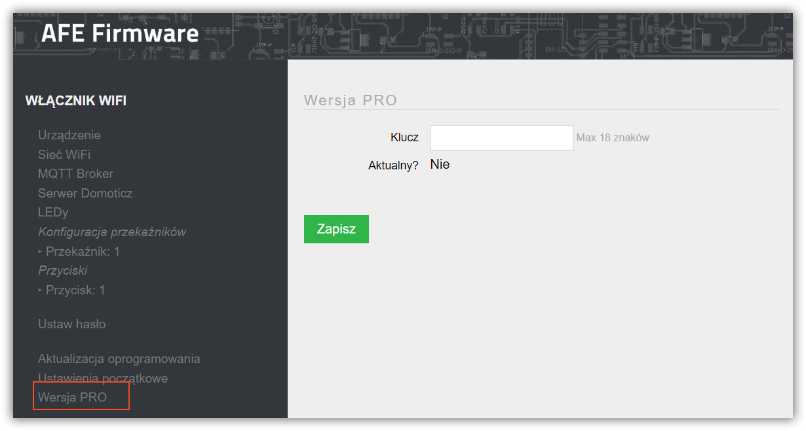

##### Co to jest AFE Firmware PRO?
> Wersja AFE Firmware oferuje dodatkowe funkcje, które:
>	* nie są dostępne w wersji standardowej
>	* przedpremiery
>	* wersje ekperymentalne
>	* funkcje specjalnie zamówione 

##### Dla kogo dostępne jest AFE Pro?
> Dla użytkowników posiadających klucz odblokowujący.

##### Dla kogo dostępny jest klucz AFE Pro?
>* zasłużonych użytkownków [Forum Smart'ny Dom](https://forum.smartnydom.pl?target=_blank). Od 5 gwiazdek na Forum. 
>	* _Uwaga: jeśli masz 5 gwiadek, a nie masz klucza to daj znać._
>* osób wspierających [Stronę](https://www.smartnydom.pl?target=_blank), [Forum Smart'ny Dom](https://forum.smartnydom.pl?target=_blank) lub [projekt AFE Firmware](https://pl.donate.afe-firmware.smartnydom.pl?target=_blank)
>* aktywnych testerów oprogramownia AFE Firmware

##### Jakie są funkcjonalności w AFE Pro?
> Stan na dzisiaj
>* Obsługa [wejścia analogowo-cyfrowago](/konfiguracja/konfiguracja-urzadzenia/konfiguracja-wejscie-analogowe)
>* Obsługa [czujnika wykrywania burzy AS3935](/konfiguracja/konfiguracja-urzadzenia/konfiguracja-czujnikow/as3935)
>* Obsługa czujników [BH1750](/konfiguracja/konfiguracja-urzadzenia/konfiguracja-czujnikow/bh1750) oraz czujników [Bosch s serii BMEx80](/konfiguracja/konfiguracja-urzadzenia/konfiguracja-czujnikow/bosch-bmx) dla sterownika bramy (AFE T5)
>* Pomiar naładowania stanu bateri w Stacji Pogody (AFE T6)

##### Mam klucz, co dalej?
> Klucz wprowadza się w Panelu konfiguracyjnym, urządzenie musi być podłączone do Routera WiFi, który ma dostęp do Internetu, żeby aktywować klucz.
 
 