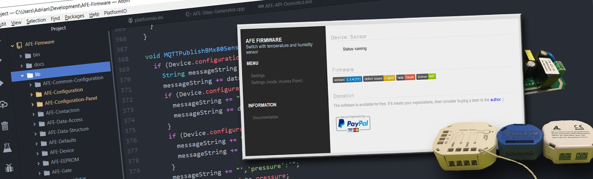

AFE Firmware to oprogramowanie napisane  z myślą o układzie ESP8266/8285, który coraz częściej spotykany jest w komercyjnych produktach. Układ jest stosunkowo tani i umożliwia tworznie własnych modułów niemalże, jak z klocków. Moduł z AFE Firmware znajdują głównie wykorzystanie w inteligentnych domach. Moduły mogą sterować oświetleniem, bramami, systemem do nawadniania ogródka, jak również odczytywać różne parametry: temperatura, wilgotność, ciśnienie atmosferyczne, pyłki zawieszone i wiele innych.

Moduł z zainstalowanym AFE Firmware może być bezprzewodowo sterowany przez systemy do automatyki np. openHAB, Domoticz, Domotiga, HomeAssistant i pewnie przez wiele innych systemów do automatyki. 

! AFE Firmware to tylko oprogramowanie dla urządzenia. Aby nim sterować musisz posiadać dodatkowo system do automatyki w swoim domu / biurze np. openHAB, Domoticz itp. Jeśli wgrasz AFE Firmware do np. Sonoff’a, Shelly to nie będzie możliwe jego sterowanie przy pomocy oryginalnie dostarczonych z urządzeniem aplikacji.

!! ##### WARUNKI KORZYSTANIA ZE STRONY
!! 
!! Instalacja elektryczna wydaje się stosunkowo prosta, jednak błędy popełnione przy jej wykonywaniu mogą mieć **katastrofalne skutki**. Dlatego wszelkie przeróbki należy zlecić osobie z uprawnieniami do wykonywania instalacji i do przeprowadzania ich pomiarów odbiorczych.
!! Właściciel strony NIE ponosi, żadnej odpowiedzialności za szkody majątkowe i niemajątkowe, bezpośrednio lub pośrednio wynikające z uzyskania informacji na niniejszej stronie oraz stronach internetowych, do których linki zostały tutaj zamieszczone.
!! **Z informacji umieszczonych na stronie korzystasz na własną odpowiedzialność**.