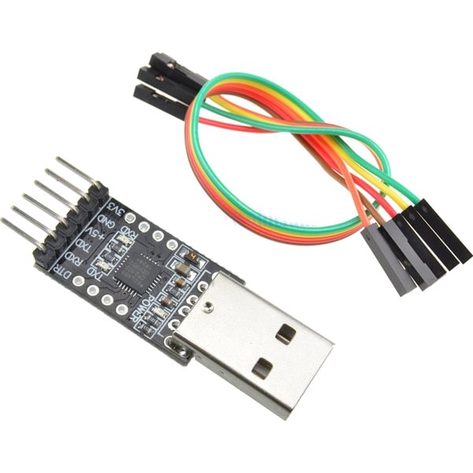

* Konwerter USB na TTL 3.3V oparty np. na układzie CP2102 lub CH340

* Oprogramowanie NodeMCU Flasher pobrane w zależności od wersji Windows
	* [NodeMCU Flasher 32 Bit](https://github.com/nodemcu/nodemcu-flasher/blob/master/Win32/Release/ESP8266Flasher.exe?target=_blank)
	* [NodeMCU Flasher 64 Bit](https://github.com/nodemcu/nodemcu-flasher/blob/master/Win64/Release/ESP8266Flasher.exe?target=_blank)
* 4 przewody, aby podłączyć konwerter USB-TTL z przełącznikiem – gniazdem szpilkowym
* (Opcjonalnie dla wygody) Kable wtyczka USB – gniazdo USB – do podłączenia Konwertera USB-TTL z komputerem