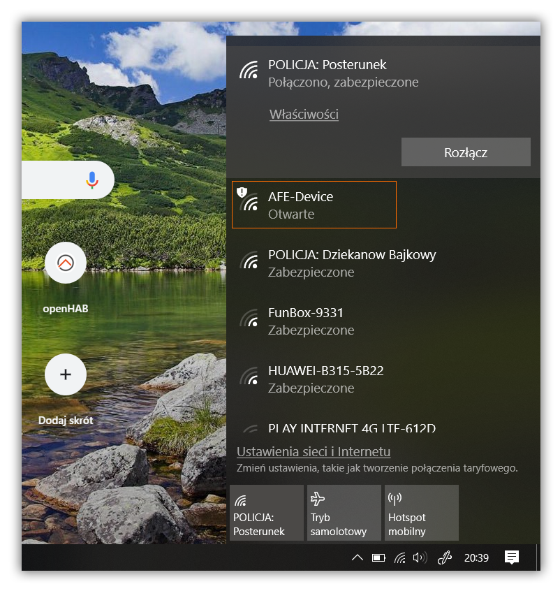
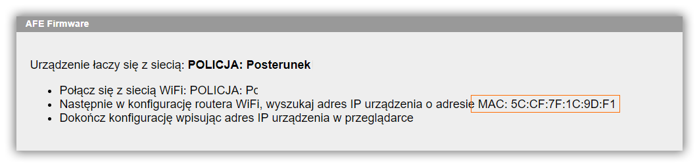

* Pierwsze uruchomienie może trwać ok 1 minutę

!!!! Podczas pierwszego uruchomienia formatowana jest pamięć urządzenia, a następnie tworzona jest konfiguracja domyślna AFE Firmware

* Po zainstalowaniu firmware urządzenie jest w trybie Access Point (HotSpot)
* Jeśli do urządzenia podłączona jest dioda LED do GPIO13 to powinna migać
* Wyszukaj i połącz się z siecią WiFi o nazwie AFE-Device



* Po podłączaniu do sieci WiFI o nazwie AFE-Device otwórz przeglądarkę Internetową, a następnie wprowadz adresie URL: http://192.168.5.1
* Po chwili powinna uruchomić się strona konfiguracyjna połączenia do sieci WiFi
*  Wprowadzamy tutaj parametery sieci WiFi, którą mamy w domu/biurze


* Pierwsza sekcja ekranu konfiguracji służy do wybrania naszej sieci WiFi oraz wprowadzenia hasła.
>Jeśli na liście nie ma widocznej naszej sieci WiFi można spróbować wyszukać ponownie dostępne sieci w pobliżu urządzenia. Wciśnij przycisk **Odśwież**. Jeśli sieć WiFi nie zostanie odnaleziona sugeruję umieścić urządzenie bliżej routera WiFi.

! Urządzenia z układem WiFi ESP8266/8285 działają jedynie w sieci WiFi 2.4GHz. Układ nie obsługuje sieci WiFi w paśmie 5GHz.

* Druga sekcja ekranu umożliwia ustawienie stałego adresu IP dla urządzenia.
* Domyślnie adres IP przydzialany jest automatycznie przez router WiFi (opcja: **_Konfiguracja przez DHCP_** jest **zaznaczone**)
* Aby skonfigurować staly adres IP, konieczne jest wprowadzenie adresu IP, Bramki oraz Maski sieci
>Przed skonfigurowaniem stałego adresu IP należy upewnić się, czy router WiFi umożliwia nadawanie stałego adresu IP oraz czy nadawany adres IP nie jest używany przez inne urządzenie w ramach sieci WiFi

###### Przykład: 
```js
Adres IP: 192.168.1.100
 Bramka: 192.168.1.1  // Brama IP to najczęściej adres IP routera WiFi
 Maska sieci: 255.255.255.0
```

! Błędne ustawienia adresu IP, bramki lub maski sieci może spowodować utratę dostępu do urządzenia. W takiej sytuacji, konieczne może być, ponowne wgranie firmware z wcześniejszym wyczyszczeniem całej pamięci flash urządzenia 

* Ostatnia sekcja z tytułem **Zaawansowane**, pozwala na ustawienie dodatkowych parametrów dotyczących nawiązywania połączenia z siecią WiFi
>Sugeruję nie zmieniać tych parametrów podczas pierwszego uruchomienia urządzenia. Parametry zostały opisane na stronie [Konfiguracja sieci WiFi](/konfiguracja/konfiguracja-sieci-wifi)

---
Po skonfigurowaniu oraz zapisaniu parametrów sieci WiFi urządzenie zostanie ponownie uruchomiona i będzie próbowało nawiązać połączenie z siecią WiFi.

!!! Jeśli do urządzenia podłączona jest dioda LED do GPIO13 to podczas łączenia się z siecią WiFi dioda będzie migać z częstotliwością około 1 sekundy. Po podłączeniu się do sieci WiFi dioda powinna migać kilka razu na sekundę.

Po nawiązaniu połączenia z siecią WiFi możemy dokończyć konfigurację. W tym celu należy wprowadzić adres IP urządzenia nadany przez router WiFi lub adres IP nadany ręcznie podczas konfiguracji do przeglądarki internetowej.

>Adres IP urządzenia można odnaleść w konfiguracji routera WiFi. Należy wyszukać adres IP urządzenia z adresem MAC podanym na ekranie konfiguracji AFE Firmware. 

>Aby odszukać adres IP urządzenia w routerze WiFi należy sprawdzić w dokumentacji routera lub poprosić o pomoc na [Forum AFE Firmware](https://www.smartnydom.pl/forum/afe-firmware/?target=_blank)

---
