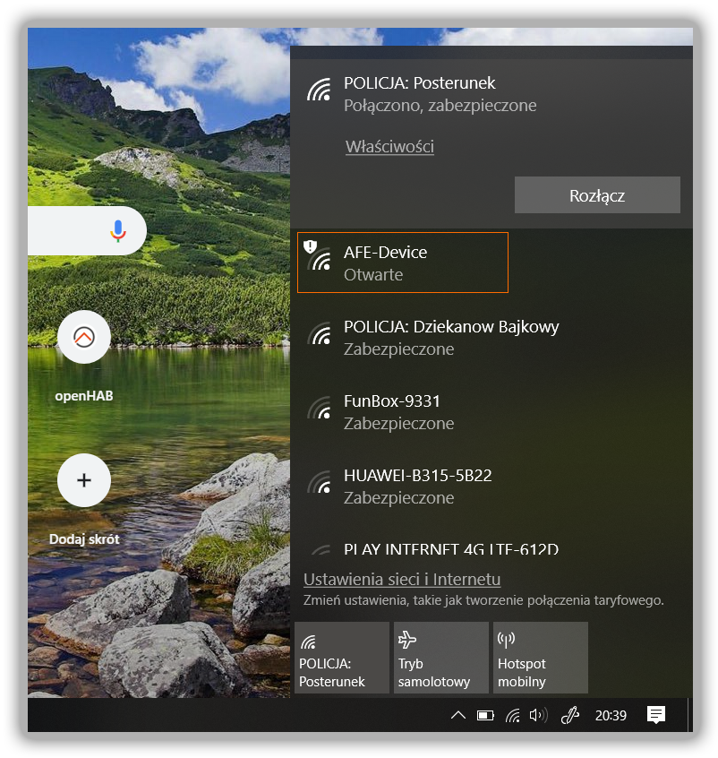

* Pierwsze uruchomienie może trwać ok 1 minutę

!!!! Podczas pierwszego uruchomienia formatowana jest pamięć urządzenia, a następnie tworzona jest konfiguracja domyślna AFE Firmware

* Po zainstalowaniu firmware urządzenie jest w trybie Access Point (HotSpot)
* Jeśli do urządzenia podłączona jest dioda LED do GPIO13 to powinna migać
* Wyszukaj i połącz się z siecią WiFi o nazwie AFE-Device

* Po podłączaniu do sieci WiFI o nazwie AFE-Device powinna uruchomić się przeglądarka Internetowa (testowane na Windows oraz iOS), a następnie po chwili powinna uruchomić się automatycznie strona konfiguracyjna AFE Firmware

!!!! Jeśli przeglądarka lub strona konfiguracyjna AFE Firmware nie uruchomi się automatycznie to otwórz przeglądarkę Internetową, a następnie otwórz stronę o adresie URL: http://192.168.5.1

