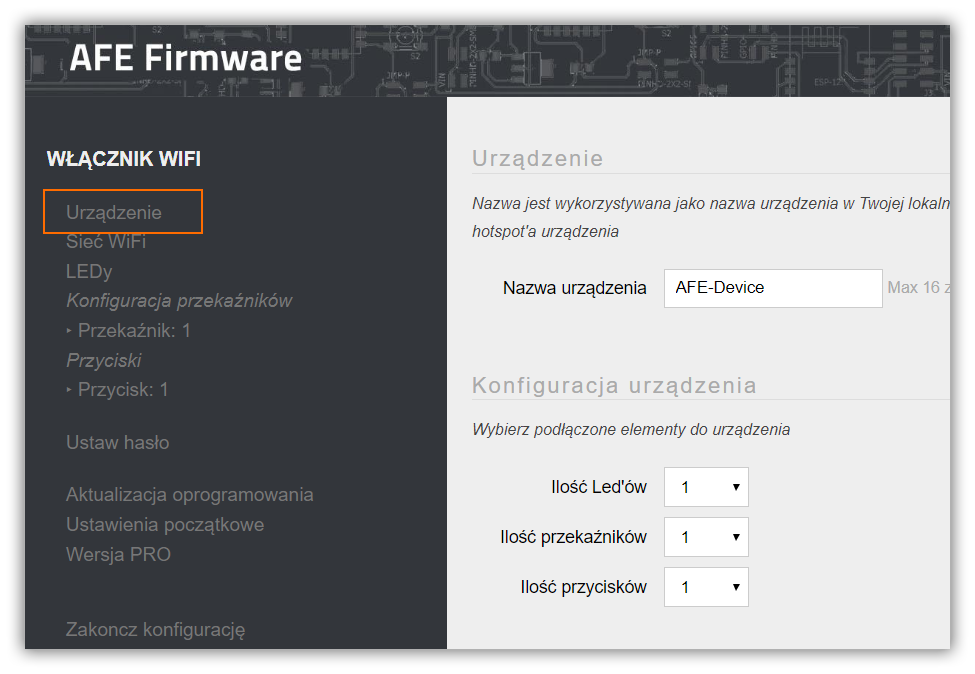
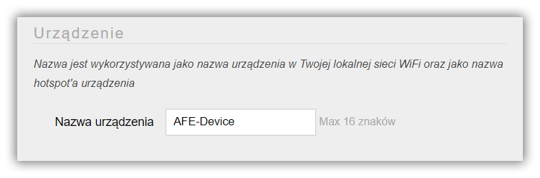
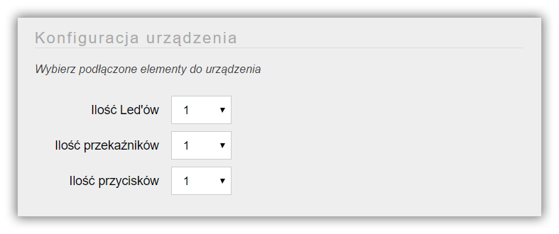
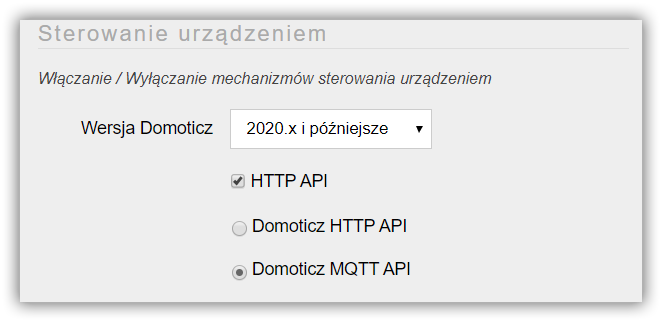

Forumularz konfiguracji urządzenia umożliwia 
* nadanie unikalnej nazwy urządzeniu, 
* określenie elementów, jak diody LED, przkaźniki, przyciski, czujniki podłączone do ESP8266/8285 oraz 
* wybranie mechanizmów integracji (API) z systemami do automatyki.

---


**Spis treści**

    
    
    {{ table_of_contents }}
    



---

Ekran do konfiguracji urządzenia uruchamia się zaznaczając element **Urządzenie** w menu Panelu Konfiguracyjnego AFE Firmware.

#### Sekcja: Urządzenie

##### Nazwa urządzenia
* Powinna to być unikalną nazwą urządzenia w ramach twojej lokalnej sieci (LAN).
* Podczas konfiguracji urządzenia w trybie Access Point (HotSpot) wpisana wartość stanie się nazwą sieci WiFi urządzenia
* Wprowadzenie **Nazwy** jest wymagane

! Jeśli do sterowania urządzeniami wykorzystywany jest MQTT API to każde urządzenia łączące się z brokerem MQTT musi mieć unikalną nazwię

#### Sekcja: Konfiguracja urządzenia

* W tej sekcji wybierane są jakie elementy typu przekaźniki, czujniki, diody LED itp są podłączone do urządzania

!!!! Jakie elementy są do wyboru uzależnione jest od wersji AFE Firmware

* Włączenie danego elementu powoduj uaktywnienie sekcji konfiguracji w menu panelu konfiguracji dla danego elementu urządzenia
* Liczba określa ile elementów danego typu jest podłączonych do ESP8266/8285

#### Sekcja: Sterowanie urządzeniem
* Włączanie / wyłączanie mechanizmów sterowania urządzeniem (API)
* Włączanie danego API, jeśli tego wymaga, uaktywnia sekcję konfiguracyjną w menu Panelu Konfiguracyjny
* Domoticz API wymaga do swojego poprawnego działania, również włączone HTTP API
>Które API wybrać? W przypadku Domoticz odpowiedź jest stosunkwo prosta: Domoticz API + HTTP API. W przypadku innych systemtów do sterowania inteligentnym domem np. openHAB, HomeAssistant wybór należy do Ciebie. Osobiście zachęcam korzystać z protokołu MQTT. Został on stworzyny właśnie z fokusem na transmisję danych dla urządzeń IoT i nie tylko. MQTT wykorzystuje duzi gracze FB, Amazon. Jest szybki i nie ma dużo narzutu na transmisję danych.
