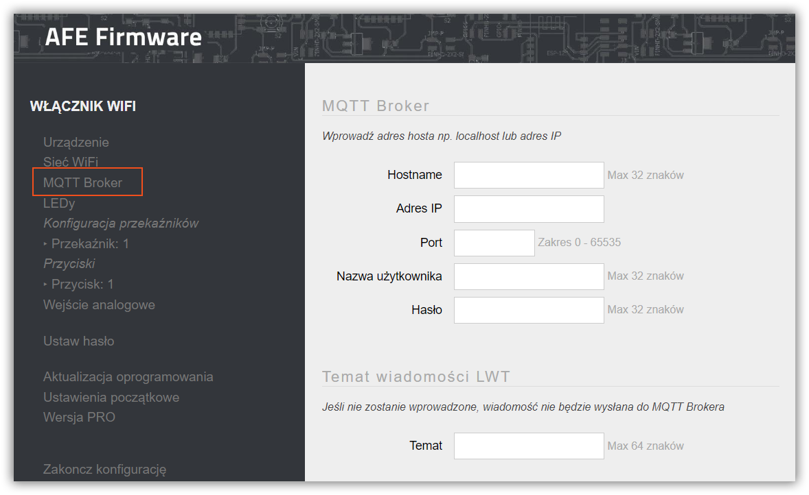

MQTT Broker to oprogramowanie, które w dużym skrócie zajmuje się odbieraniem widomości od klientów publikujących wiadomości, a następnie rozsyłanie ich do klinetów, którzy te wiadomości subskrybują. 

MQTT to jeden z [mechanizmów sterowania urządzeniem](/integracja-api) w ramach AFE Firmware.

Formularz ten służy do
* konfiguracji połączenia do Brokera MQTT oraz 
* ustawienia tematu LWT

---


**Spis treści**

    
    
    {{ table_of_contents }}
    



---

Aby skonfigurować połaczenie do Brokera MQTT, należy wybrać **MQTT Broker** w menu konfiguracyjnym AFE Firmware

### Sekcja: konfiguracja połaczenia do brokera MQTT

#### Hostname
* Nazwa hosta / domena serwera, na którym pracuje broker MQTT
* Maksymalnie: 32 znaki
* Informacja jest wymagana jeśli nie jest wprowadzony adres IP serwera (poniższy parametr)

!!!! Alternatywnie można wprowadzić adres IP serwera, na którym pracuje broker MQTT (parametr poniżej)

#### Adres IP
* Adres IP serwera, na którym pracuje broker MQTT
* Informacja jest wymagana jeśli nie jest wprowadzona nazwa hosta / domeny (powyższy parametr)

!!!! Alternatywnie można wprowadzić nazwę hosta / domenę serwera, na którym pracuje broker MQTT (parametr powyżej)

#### Port
* Port, na którym nasłuchuje broker MQTT
* Zakres od: 1 do 65535
* Wartość domyślna to: 1883
* Informacja jest wymagana

#### Użytkownik
* Nazwa użytkownika do brokera MQTT
* Maksymalnie 32 znaki
* Informacja jest wymagana jeśli broker MQTT wymaga autentykacji

#### Hasło
* Hasło użytkownika do brokera MQTT
* Maksymalnie 32 znaki
* Informacja jest wymagana jeśli broker MQTT wymaga autentykacji

#### Limit czasu odpowiedzi
* Czas oczekiwania na odpowiedź z MQTT Brokera
* Maksymalnie 30 sekund
* Wartość wymagana, standardowo 5 sekund
* Jednosta wprowadzania: milisekundy

> Jeśli jest konieczność, aby urządzenie działało lub działało szybciej podczas sytuacji odłączenia MQTT Brokera od sieci LAN, Limit ten należy obniżyć do np.200msek. W przypadku zmiany wartości domyślnej, wymiana danych między brokerem MQTT, a urządzeniem może nie działac w 100% prawidłowo. Wartość należy ustawić metodą prób i błędów do uzyskania pożądanego efektu.

### Sekcja: Konfigurcja wiadomości LWT

Wiadomość LWT (Last Will and Testament), wykorzystywana jest, aby powiadomić innych klientów o niespodziewanym odłączeniu urządzenia od brokera MQTT. 

W przypadku 
* Standardowego API, AFE Firmware wysyła wiadomość do brokera MQTT o podłączeniu się urządzenia od brokera MQTT. Gdy urządzenie rozłączy się MQTT Broker publikuje informację o rozłączeniu się urządzenia od MQTT Brokera.
* Domoticz API, AFE Firmware aktualizuje stan wirtualnego przełącznika, który informuje, czy urządzenie jest podłaczone lub rozłączone od MQTT Brokera

> Funkcjonalność można wykorzystać między innymi do: monitorowania podłączenia urządzenia do brokera WiFi,  utraty połączenia z siecią WiFi, niespodziewanych brakach zasilania, czy "zawieszeniu" się urządzenia

#### Temat 

* widoczne dla AFE Firmware ze standardowym MQTT API
* temat MQTT
* Informacja nie jest wymagana. W przypadku nie wprowadzenia tematu wiadomości LWT, nie będzie do brokera MQTT wysyłana informacja o połączeniu / rozłączeniu się urządzenia od brokera MQTT
* Więcej o tematach MQTT moższ znaleśc w rodziale: [Integracja API MQTT](/integracja-api/mqtt)

#### IDX 

* widoczne dla AFE Firmware z Domoticz MQTT API
* Wartość z zakresu 1 do 999999
* W przypadku wprowadzenia 0, LWT nie będzie wysyłane do Domoticz
* Więcej o tematach Domoticz MQTT API moższ znaleśc w rodziale: [Domoticz API](/integracja-api/domoticz-api)