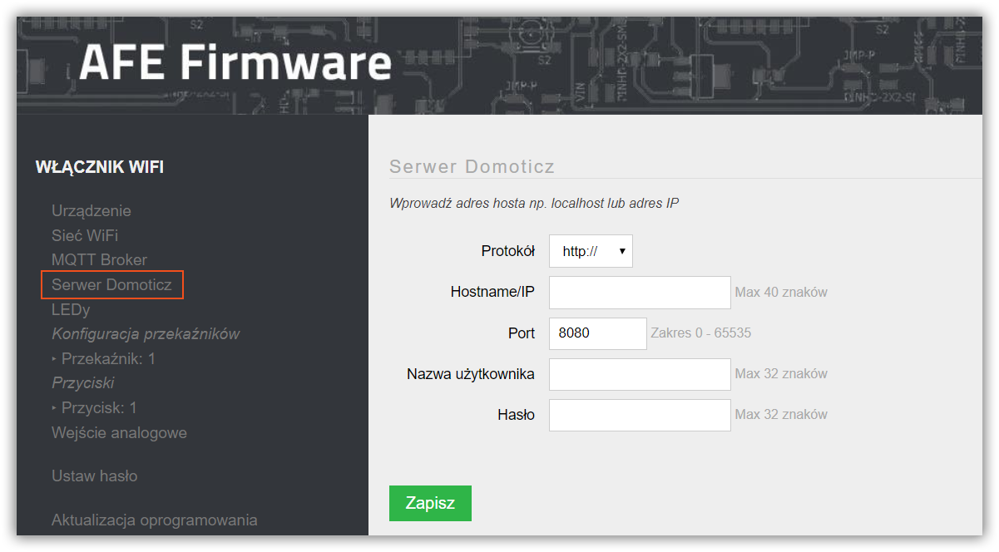

AFE Firmware wspiera dwukierunkową [integrację z oprogramowaniem Domoticz](/integracja-api/domoticz-api). Oznacza to, że Domoticz może sterowac urządzeniem z AFE Firmware, jak również AFE Firmware może wysyłać do Domoticz informacje takie jak: stan przekaźników, przycisków, wartości z czujników itp.

Aby urządzenie z AFE Firmware współpracowało z Domoticz, należy skonfigurować połączenie do serwera Domoticz.

---


**Spis treści**

    
    
    {{ table_of_contents }}
    



---

Konfigurację połączenia do serwera Domoticz można wykonać wciskając pozycję **Serwer Domoticz** w menu AFE Firmware

#### Protokół

* do wyboru http:// lub https://

#### Hostname/IP

* nazwa hosta w ramach loklanej sieci wifi, adres URL lub adres IP na którym jest zainstalowany Serwer Domoticz
* wartość jest wymagana

#### Port

* port, na którym pracuje serwer Domoticz
* domyślnie 8080
* zakres: 1 do 65535
* wartość jest wymagana

#### Nazwa użytkownika

* nazwa użytkownika serwera Domoticz, jeśli jest włączona autoryzacja do serwera Domoticz

!!!! AFE Firmware wspiera autoryzację do serwera Domoticz, z wykorzystaniem **Zabezpieczenie WWW** w trybie uwierzytelniania: **Podstawowe okno logowania** oraz **Strona Logowania*

#### Hasło

* Hasło użytkownika serwera Domoticz, jeśli jest włączona autoryzacja do serwera Domoticz