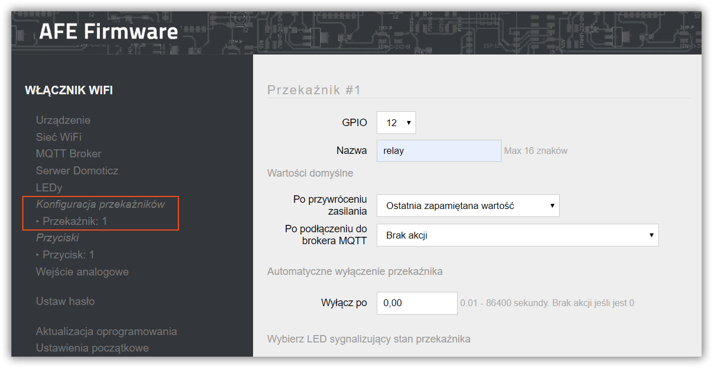
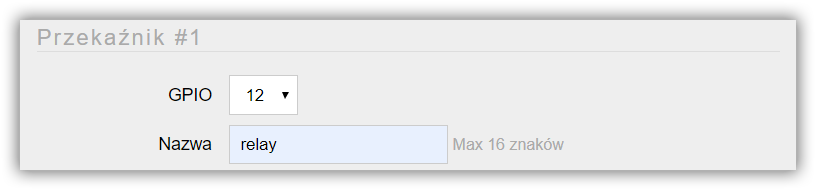
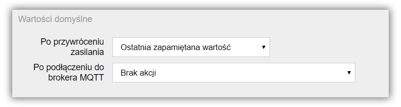
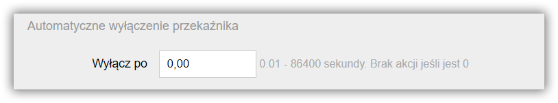
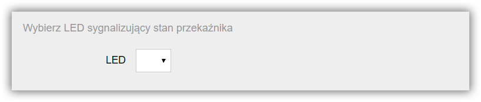
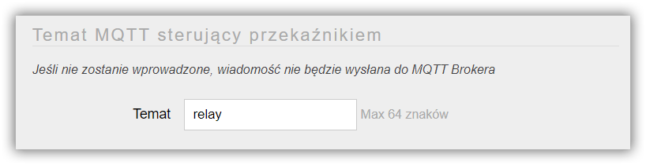

Jednym z podstawowych komponentów podłaczanch do ESP8266/8285 i stosowanych w automatyce są przekaźniki / styczniki. Służą one do otwierania / zamykania obwodów. Najpopularniejsze zastosowanie do włączanie / wyłączanie podłączonych do modułu urządzeń elektrycznych np. oświetlenia

Ekran do konfiguracji przekaźnika uruchamia się wybierając pozycję **Przekaźnik** w menu AFE Firmware.

!!!! W zależności od AFE Firmware oraz [wyboru ilości podłączonych do ESP8266/8285 przekaźników](/konfiguracja/konfiguracja-urzadzenia), odpowiednia ilość przekaźników będzie dostępna do konfiguracji



#### Sekcja: przekaźnik



##### GPIO
* Numer GPIO do którego podłączony jest przekaźnik
* Zakres od 0 do 16
* Wartość musi zostać wybrana

##### Nazwa
* Unikalna nazwa przekaźnika
* Nazwa przekaźnika wykorzystywana jest do [sterowania](/integracja-api) przekaźnikiem za pomocą [HTTP](/integracja-api/http) oraz [Domoticz](/integracja-api/domoticz-api) API
* Każdy przekaźnik w ramach modułu **musi** mieć unikalną nazwę
* Maksymalna długość nazwy to do 16 znaków
* Nie należy używać znaków spacji 

``` 
Przykład: relay1 
```

#### Sekcja: wartości domyślne

W tym miejscu ustawiane są wartości domyślne przekaźnik w zależności od wystąpienia zdarzenia
* podłączenia modułu do zasilania
* podłączenia modułu do brokera MQTT - jeśli [MQTT API](/integracja-api/mqtt) jest używane

> Kiedy ta funkcja może się przydać? Na przykład, gdy wystąpi utrata zasialnia w domu, a po przywróceniu zasilania konieczne jest udstawienie przekaźnika w odpowiednim stanie na przykład: wyłączony 



##### Po przywróceniu zasilania
* Parametr określa stan przekaźnika jaki powinien zostać ustawiony po podłączeniu zasilania lub przywróceniu zasilania po jego utracie
* Możliwe wartości
	* brak akcji (ustawiany jest domyślny stan sprzętowy urządzenia)
	* włączony
	* wyłączony
	* ostatni zapamiętany stan
	* odwrotny do ostatnio zapamiętanego stanu

##### Po podłączeniu do brokera MQTT
* Parametr określa stan przekaźnika jaki powinien zostać ustawiony po nawiązaniu połączenia urządzenia z brokerem MQTT.
* Możliwe wartości:
	* brak akcji
	* wyłączony
	* włączony
	* ostatnia zapamiętany stan
	* odwrotny do ostatnio zapamiętanego stanu
	* wartość z systemu do sterowania przekaźnikiem (przez MQTT)

! W przypadku ustawienia wartości: **wartość z systemu do sterowania przekaźnikiem (przez MQTT)** w systemie do automatyki musi zostać zaimplementowana odpowiednia reguła / kod, który obsłuży takie żądanie 

#### Sekcja: automatycznie wyłączanie przekaźnika

Funkcja wykorzystywana do automatycznego wyłączania przekaźnika po zadanym czasie. 

> Typowe zastosowanie: wyłączanie oświetlenia po zadanym czasie



##### Wyłącz po
* Firmware ma wbudowany mechanizm automatycznego wyłączania przekaźnika po zadanym czasie
* Minimalny czas: 10 milisekund
* Maksymalny czas 24 godzin
* Czas ustawiany jest w sekundach od 0.01 do 86400 sekund
* Funkcja automatycznego wyłączania przekaźnika jest wyłączona, gdy wartość tego parametru jest równa 0.

#### Sekcja: dioda LED sygnalizaująca stan przekaźnika

Jeśli do ESP8266/8285 podłączona jest [dioda LED](/konfiguracja/konfiguracja-diody-led), to może ona sygnalizować stan przekaźnka tzn. może świecić, gdy przekaźnik jest włączony (lub odwrotenie)

! Aby dioda miała oczekiwania zachowanie, tzn świeciła, gdy przekaźnik jest włączony lub była zgaszona należy [diodę LED odpowiedno skonfigurować](/konfiguracja/konfiguracja-diody-led) w AFE Firmware



##### LED
* Number diody LED, która ma sygnalizować stan przekaźnika


#### Sekcja: Domoticz

!! Sekcja konfiguracyjna widoczna jest tylko, gdy [włączone jest Domoticz API](/konfiguracja/konfiguracja-urzadzenia)

Aby mieć możliwość podglądu stanu przekaźnika w Domoticz, konieczne jest wprowadzenie IDX Urządzenia przypisane w Domoticz do konkretnego przekaźnika.

Tutaj znajdziesz: [jak znaleść IDX urządzenia w Domoticz](/integracja-api/domoticz-api/gdzie-znalezc-idx).


##### IDX
* Wartość z zakresu 1 do 999999
* W przypadku wprowadzenia 0, stan przekaźnika nie będzie wysyłany do Domoticz

#### Sekcja: konfiguracja tematu MQTT sterującego przekaźnikiem

!! Sekcja konfiguracyjna widoczna jest tylko, gdy [włączone jest MQTT API](/konfiguracja/konfiguracja-urzadzenia)

Aby było możliwe sterowanie przekaźnikiem z wykorzytaniem [MQTT API](/integracja-api/mqtt), konieczne jest ustawienie Tematu MQTT sterujacego przekaźnikiem
 


##### Temat
* Temat wiadomości w formacie MQTT
* Maksymalnie 64 znaki
* Jeśli temat nie zostanie wprowadzony, przekaźnikeim nie będzie można sterować za pomocą [wiadomości MQTT.](/integracja-api/mqtt) Moduł również nie będzie wysyłał stanu przekaźnika do brokera MQTT przy ręcznej zmianie stanu przekaźnika. 
* **Ważne:** Temat MQTT nie może kończyć się znakiem **/**

> Tutaj znajdziejsz: [Najlepsze praktyki dotyczące formatów tematów MQTT](/integracja-api/mqtt/tematy-mqtt-najlepsze-praktyki)
