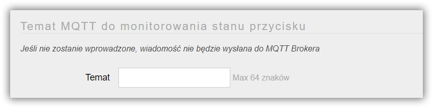

Do ESP8266/8285 można w zależności od wersji AFE podłączyć od 1 do N przycisków, które moga pełnić różne funkcje.

---


**Spis treści**

    
    
    {{ table_of_contents }}
    



---

Ekran do konfiguracji przycisku uruchamia się zaznaczając element Przycisk  w menu Panelu Konfiguracyjnego AFE Firmware.

!!!! W zależności od AFE Firmware oraz [wyboru ilości podłączonych do ESP8266/8285 przycisków](/konfiguracja/konfiguracja-urzadzenia), odpowiednia ilość przycisków będzie dostępna do konfiguracji

#### Sekcja: przycisk / włącznik

##### GPIO

* Numer GPIO do którego podłączona jest przycisk / włącznik
* Zakres od 0 do 16
* Wartość musi zostać wybrana

##### Funkcja

* Dostępne są następujące funkcje
	* przycisk multifunkcyjny
	* sterowanie przekaźnikiem

!! Przycisk Multifunkcyjny musi mieć Typ: **monostabilny**.

* Przycisk Multifunkcyjny posiada następujące funkcje
	* krótkie wciśnięcie: sterowanie przekaźnikiem włącz / wyłącz (jeśli przekaźnik jest przypisany do przycisku)
	* wciśniecie na 5sek do 10sek – uruchamianie Panelu Konfiguracyjnego ([dioda systemowa LED](/konfiguracja/konfiguracja-diody-led/dioda-systemowa) mignie 1x)
	* wciśnięcie dłużej niż 10sek – uruchamianie Panelu Konfiguracyjnego w trybie HotSpot ([dioda systemowa LED](/konfiguracja/konfiguracja-diody-led/dioda-systemowa) mignie 2x)
	* wciśnięcie 30 - 35 sekund - ustawianie wartości domyślnych  ([dioda systemowa LED](/konfiguracja/konfiguracja-diody-led/dioda-systemowa) mignie 3x)

##### Przekaźnik sterowany tym przyciskiem
* Przycisk może włączać lub wyłączac przekaźnik podłaczony do modułu. 
* Do wyboru mam jeden z podłączonych do urządzenia przekaźników

##### Typ
* Przycisk / włącznik może mieć typ:
	* monostabilny
	* bistabilny

> Najpopularniejszym przyciskiem/włącznikiem monostabilnym jest przycisk dzwonkowy. Przycisk/włącznik bistabilny to taki, który ma dwa stany: włączony/wyłączony - większość przycisków w ścianie do włączania oświetlenia to przyciski bistabilne.
 

#### Sekcja: czułość (bouncing)

##### Czułość (bouncing)
* Parametr określa czas reakcji przycisku / włącznika
* Im niższa wartość tym przycisk jest bardziej czuły na zmiany
* Zakres od 0 do 999 milisekund

! Wartość parameteru należy zmienić wyłączenie jeśli podczas korzystania z przycisku występują nadmiarowe włączenia/wyłaczenia. Moga być one powodowane mikrodrganiami styków. Ustawienie tej wartości należy dokonać metoda prób i błędów, aż do uzyskania pożądanego efektu

#### Sekcja: Domoticz

!! Sekcja konfiguracyjna widoczna jest tylko, gdy [włączone jest Domoticz API](/konfiguracja/konfiguracja-urzadzenia)

Aby mieć możliwość podglądu stanu przycisku w Domoticz, konieczne jest wprowadzenie IDX Urządzenia przypisane w Domoticz do konkretnego przycisku.

Tutaj znajdziesz: [jak znaleść IDX urządzenia w Domoticz](/integracja-api/domoticz-api/gdzie-znalezc-idx).

##### IDX
* Wartość z zakresu 1 do 999999
* W przypadku wprowadzenia 0, stan przycisku nie będzie wysyłany do Domoticz

#### Sekcja: konfiguracja tematu MQTT informującego o stanie przycisku

!! Sekcja konfiguracyjna widoczna jest tylko, gdy [włączone jest MQTT API](/konfiguracja/konfiguracja-urzadzenia)

> Na ogół nie ma potrzeby wysyłania stanu przycisku jeśli przycisk służy do włączania / wyłączania przekaźnika. Wystarczające jest wysyłanie do systemu automatki informacji o stanie przekaźnika. 

Aby było możliwe uzyskanie informacji o stanie przycisku przez [MQTT API](/integracja-api/mqtt), konieczne jest ustawienie Tematu MQTT, pod który będzie wysyłana informacja przy każdej zmianie stanu przycisku.
 
##### Temat
* Temat wiadomości w formacie MQTT
* Maksymalnie 64 znaki
* Jeśli temat nie zostanie wprowadzony nie będzie wysyłał stan przycisku do brokera MQTT
* **Ważne:** Temat MQTT nie może kończyć się znakiem **/**

> Tutaj znajdziejsz: [Najlepsze praktyki dotyczące formatów tematów MQTT](/integracja-api/mqtt/tematy-mqtt-najlepsze-praktyki)

!!! **Podpowiedź 1**: wysyłanie stanu przycisku do przycisku do Domoticz, czy innego systemu do automatyki może uruchamiać dowolne regułu.

!!! **Podpowiedź 2**: Przycisk można zastąpić innym elementem np. kontaktronem, czujnikiem magnetycznym, czujnikem ruchu, czy jakimkolwiek innym elementem, który zwiera/rozwiera układ