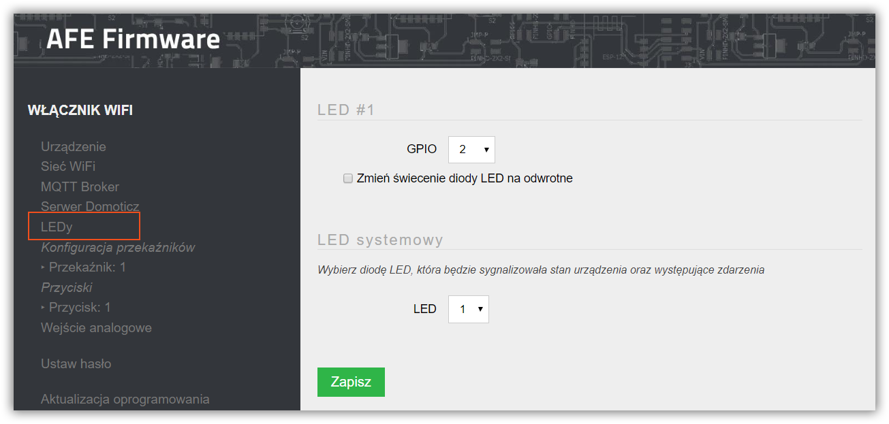
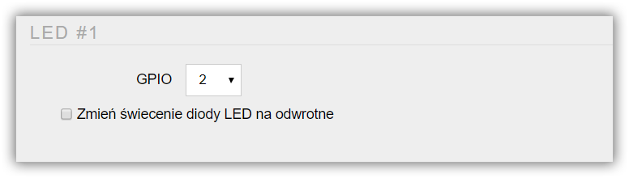
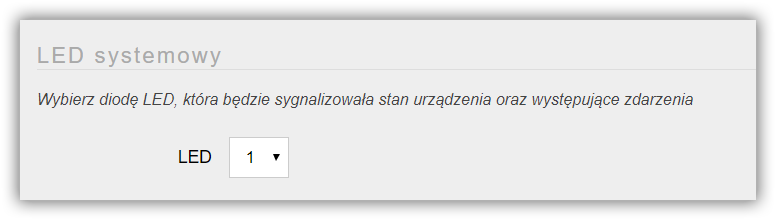

Do modułu z chip'em ESP8266/8295 można podłączyć od 1 do N diod LED, które mogę informować o zdarzeniach systemowych, bądź informować o stanie przekaźnika

!!!! W zależności od AFE Firmware oraz [wyboru ilości podłączonych do ESP8266/8285 diod LED](/konfiguracja/konfiguracja-urzadzenia), odpowiednia ilość diod LED będzie dostępna do konfiguracji

Ekran do konfiguracji diod LED uruchamia się zaznaczając element **LEDy** w menu Panelu Konfiguracyjnego AFE Firmware.

#### Sekcja: LED

##### GPIO
* Numer GPIO do którego podłączona jest dioda LED
* Zakres od 0 do 16

##### Zmienić świecenie diody LED na odwrotne
* Parametrem można odwrócić działanie diody LED, przykład
	* jeśli dioda sygnalizuje stan przekaźnika to może świecić, gdy przekaźnik jest właćzony lub wyłączony
	* jeśli dioda jest ma funkcję diody systemowej, to może świecić lub gasnąć, gdy zajdzie zdarzenie systemowe 

#### Sekcja: LED systemowy

Dioda Systemowa wykorzystywana jest do informowania o stanie urządzenia. [Więcej informacji o diodzie systemowej znajdzesz tutaj.](/konfiguracja/konfiguracja-diody-led/dioda-systemowa)

##### Dioda Systemowa
* Do wyboru jest jedna z dostępny diod LED

! Nie zalecam, aby jedna dioda LED posiadała jednocześnie funkcję diody LED oraz informowania o stanie przekaźnika.