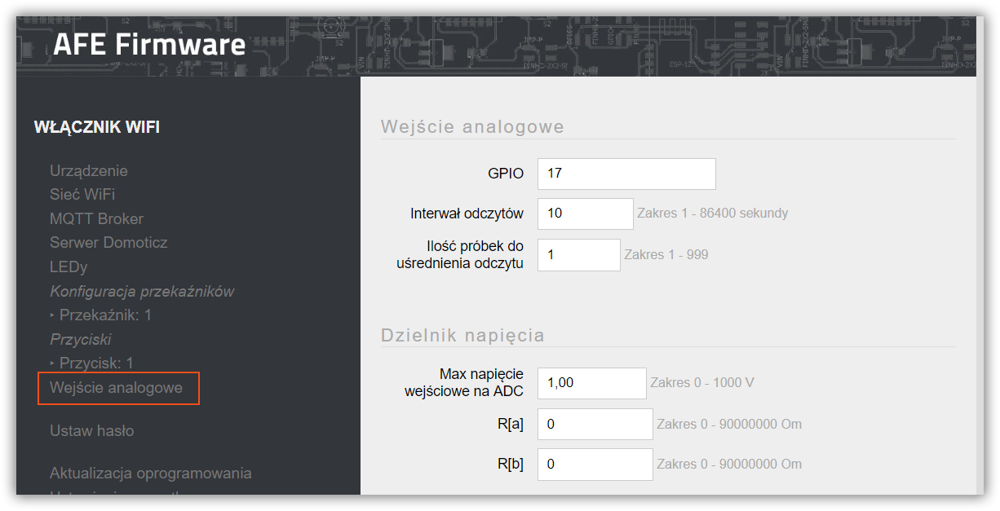
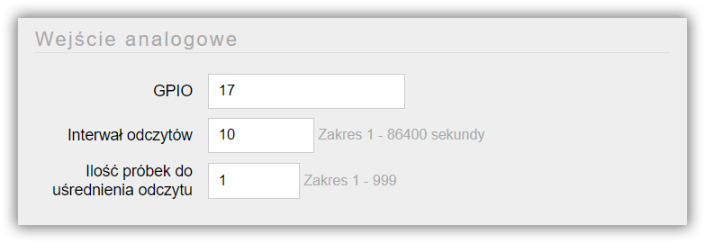
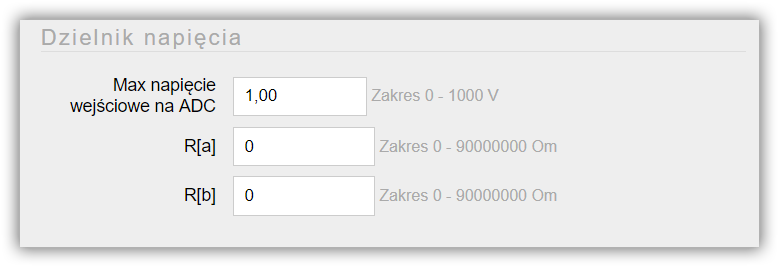
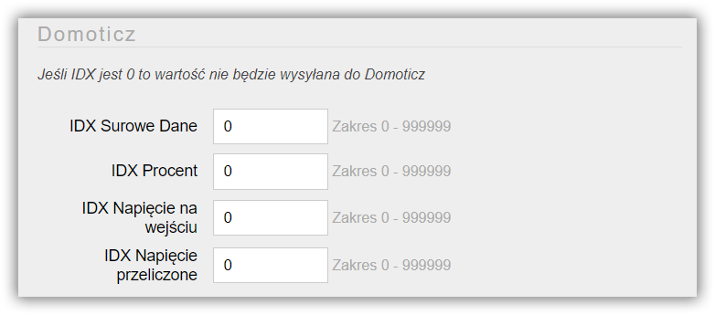
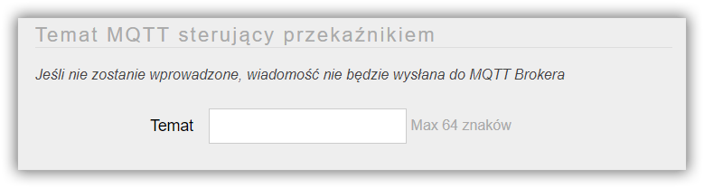

Układ ESP8266/8285 posiada wbudowany przetwornik analogowo-cyfrowy (ADC), który umożliwia odczytanie napięcia stałego. AFE Firmware daje możliwość przetwarzania tych informacji oraz wysyłania ich do systemu automatyki.

Funkcja daje możliwość przesyłania do systemu automatyki następujących wartości:
* surowe dane: _liczba naturalna w zakresie od 0 do 1023_
* napięcie wejściowe: _zakres taki jaki umożliwia wejście analogowe układu ESP8266/8285. _
> Maksymalne napięcie "gołego" ESP to najczęściej 1V
* napięcie wejściowe na ADC przeliczone do napięcia rzeczywistego, gdy wykorzystany jest dzielnik napięcia
* procent
> 100% jeśli osiągnięte zostanie maksymalne napięcie na wejściu analogowym

!!!! Przetwarzanie wartości z wejścia nalogowego dostępne jest w [wersji PRO AFE Firmware](/postawowe-informacje/wersja-pro).

Ekran do konfiguracji wejścia analogowego otwiera się wybierając opcję **Wejście Analogowe** w menu Panelu Konfiguracyjnego AFE Firmware.

#### Sekcja: wejście analogowe

##### GPIO
* Number GPIO dla wejścia analogowego
* Wartość jest wymagana
> Najczęściej to GPIO 17

##### Interwał odczytów
* Częstotliwość odczytów oraz przesyłania daych do systemu automatyki
* Wartość z zakresu od 1 sekundy do 24 godzin. Wartość wprowadza się w sekundach

##### Ilość próbek do uśrednienia odczytu
* Dla uśrednienia wartości odczytu, można wprowadzić liczbę odczytów uśredniających wynik. Próbka odczytu wykonywana jest poniżej 0,01 sek
* Zakres od 1 do 999
* Minimalna ilość odczytów to 1
* Wartość musi zostać wprowadzona

#### Sekcja: dzielnik napięcia

Paramtery konfiguracyjne w tej sekcji służą do prawidłowego przeliczania pomiarów napięcia. W przypadku zastosowania dzielnika napięcia, można wprowadzić jego wartości co spowoduje, że AFE Firmware będzie zwracało rzeczywiste wartości napięcia.

##### Maksymalne napięcie wejściowe na ADC
* Maksymalne napięcie jakie dozwolone jest na wejściu przetwornika analogowo-cyfrowego dla konkretnego układu ESP/ modułu którego używamy

> * Dla "gołego" układu ESP8266/8285 maksymalne napięcie wejściwe to najczęściej 1V, niektóre źródła podają 1.1V
> * Dla ESP Wemos 3.3V (posiada wbudowany dzielnik)

##### R[a]
* Wartość rezystora R[a] dzielnika napięcia
* Zakres od 0 do 90,000,000 omów

##### R[b]
* Wartość rezystora R[b] dzielnika napięcia
* Zakres od 0 do 90,000,000 omów

#### Sekcja: Domoticz

! Sekcja konfiguracyjna widoczna jest tylko, gdy [włączone jest Domoticz API](/konfiguracja/konfiguracja-urzadzenia)

##### IDX Surowe dane
* Wartość z zakresu 1 do 999999
* W przypadku wprowadzenia 0, surowe dane z wejścia analogowego nie będą wysyłane do Domoticz

##### IDX Procent
* Wartość z zakresu 1 do 999999
* W przypadku wprowadzenia 0, wartość przeliczona w procencie, nie będzie wysyłana do Domoticz

##### IDX Napięcie na wejściu
* Wartość z zakresu 1 do 999999
* W przypadku wprowadzenia 0, wartość napięcia na wejściu ADC, nie będzie wysyłany do Domoticz

##### IDX Napięcie przeliczone
* Wartość z zakresu 1 do 999999
* W przypadku wprowadzenia 0, wartość rzeczywista napięcia, nie będzie wysyłana do Domoticz

> Tutaj znajdziesz: [jak znaleść IDX urządzenia w Domoticz.](/integracja-api/domoticz-api/gdzie-znalezc-idx)

#### Sekcja: MQTT

! Sekcja konfiguracyjna widoczna jest tylko, gdy włączone jest MQTT API

Aby było możliwe przysłanie wartości do systemu automatyki z wykorzytaniem MQTT API, konieczne jest ustawienie Tematu MQTT dla wejścia analogowego

##### Temat
* Temat wiadomości w formacie MQTT
* Maksymalnie 64 znaki
* Jeśli temat nie zostanie wprowadzony, informacje z wejścia analogowego nie będa wysyłane do Brokera MQTT

> Tutaj znajdziejsz: [Najlepsze praktyki dotyczące formatów tematów MQTT](/integracja-api/mqtt/tematy-mqtt-najlepsze-praktyki)