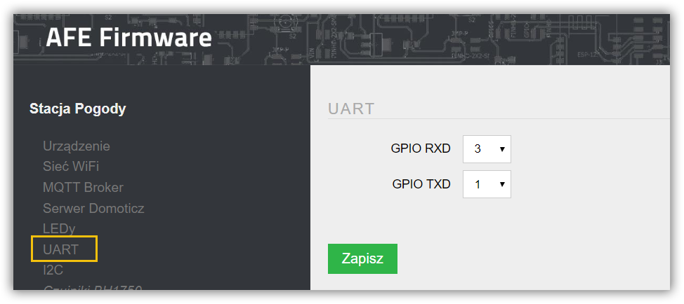

Magistrala UART umożliwia komunikację między urządzeniami. Transmisja UART polega na szeregowym przesyłaniu bitów pomiędzy np. ESP8266, a czujnikiem. W systemie ESP za transmisję odpowiadają:

* Tx - pin służący do wysyłania danych (nadajnik UART),
* Rx - pin służący do odbierania danych (odbiornik UART).

Konfiguracja magistrali UART polega na ustawieniu GPIO dla Tx (transmisja danych z ESP) oraz Rx (odbiór danych przez ESP)

> Magistrala UART wykorzystywana jest między innymi do odczytów danych z czujnika pyłów zawieszonych [Honeywell HPMA115S0](/konfiguracja/konfiguracja-urzadzenia/konfiguracja-czujnikow/honeywell-hpma115s0)

