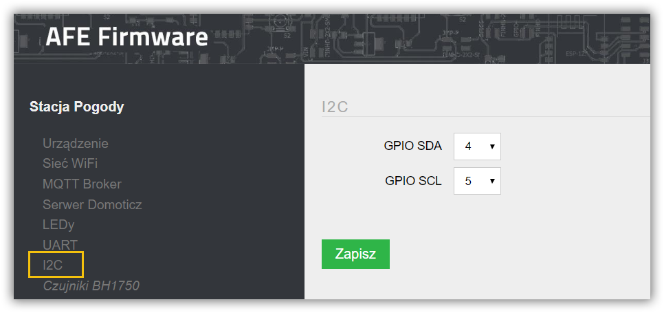

Magistrala komunikacyjna I²C umożliwia szeregową i dwukierunkowa wymianę danych w urządzeniach elektronicznych. 
I²C do transmisji wykorzystuje dwie dwukierunkowe linie: SDA – linia danych (ang. Serial Data Line) i SCL – linia zegara (ang. Serial Clock Line)

Konfiguracja I²C polega na wybraniu GPIO dla lini SDA oraz GPIO dla lini SCL

> Magistrala I²C wykorzystywana jest między innymi do odczytów danych z czujniów [BH1750](/konfiguracja/konfiguracja-urzadzenia/konfiguracja-czujnikow/bh1750), [BME680](/konfiguracja/konfiguracja-urzadzenia/konfiguracja-czujnikow/bosch-bmx), [AS3935](/konfiguracja/konfiguracja-urzadzenia/konfiguracja-czujnikow/as3935)