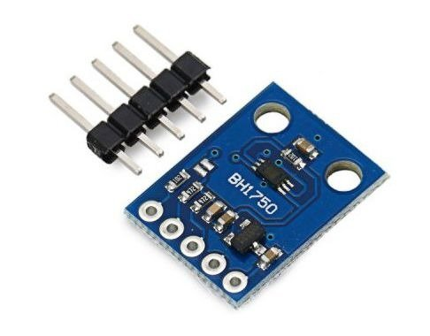

**Czujnik BH1750** umożliwia pomiar natężnia oświetlenia otoczenia. Zakres pomiarów zawiera się w przedziale 1 - 65535 LUX

##### Specyfikacja
* Napięcie zasilania: 3,6V - 6V
* Interfejs I2C
* Odpowiedź widmowa podobna do charakterystyki ludzkiego oka
* Realizacja funkcji konwertera jasność -> sygnal cyfrowy
* Szeroki zakres i wysoka rozdzielczość pomiaru (1 - 65535 lux)
* [Specyfikacja Sensor BH1750](Sensor%20BH1750.pdf)

---

!! AFE Firmware wymaga, aby czujnik podłączony został do magistrali [I²C](/konfiguracja/konfiguracja-urzadzenia/konfiguracja-portow/i2c)

---

Ekran do konfiguracji czujnka BH1750 otwiera się wybierając opcję Czujnik BH1750 -> Czujnik w menu Panelu Konfiguracyjnego AFE Firmware.

#### Sekcja: Czujnik BH1750

##### I²C Adres
* Adres czujnika w magistrali I²C
* Jeśli adres czujnika nie jest widoczny w liście sprawdź podłączenie czujnika lub konfigurację [I²C](/konfiguracja/konfiguracja-urzadzenia/konfiguracja-portow/i2c)

##### Nazwa
* Nazwa czujnika
* Nazwa wykorzystywana jest do odczytu wartości z czujnika za pomocą HTTP
* Maksymalna długość nazwy to do 16 znaków
* Nie należy używać znaków spacji

##### Interwał odczytów
* Częstotliwość odczytów oraz przesyłania daych do systemu automatyki
* Wartość z zakresu od 5 sekundy do 24 godzin. Wartość wprowadza się w sekundach

##### Czułość
* W aktualnej wersji AFE wartość jest tylko do odczytu. 
* AFE dokonuje pomiarów z najwyższą możliwą czułością czujnika

#### Sekcja: Domoticz

! Sekcja konfiguracyjna widoczna jest tylko, gdy włączone jest [Domoticz API](/konfiguracja/konfiguracja-urzadzenia/konfiguracja-urzadzenia)

AFE przesyła pomiary do wirtualnego urządzenia utworzonego w Domoticz. W konfiguracji AFE należy wpisać IDX wirtualnego urządzenia.

##### IDX
* Wartość z zakresu 1 do 999999
* W przypadku wprowadzenia 0,pomiary nie będą wysyłane do Domoticz

#### Sekcja: Temat MQTT czujnika BH1750

! Sekcja konfiguracyjna widoczna jest tylko, gdy włączone jest [MQTT API](/konfiguracja/konfiguracja-urzadzenia/konfiguracja-urzadzenia)

Aby było możliwe przysłanie wartości do systemu automatyki z wykorzytaniem MQTT API, konieczne jest ustawienie Tematu MQTT dla czujnika

##### Temat
* Temat wiadomości w formacie MQTT
* Maksymalnie 64 znaki
* Jeśli temat nie zostanie wprowadzony, informacje z wejścia analogowego nie będa wysyłane do Brokera MQTT

> Tutaj znajdziejsz: [Najlepsze praktyki dotyczące formatów tematów MQTT](/integracja-api/mqtt/tematy-mqtt-najlepsze-praktyki)