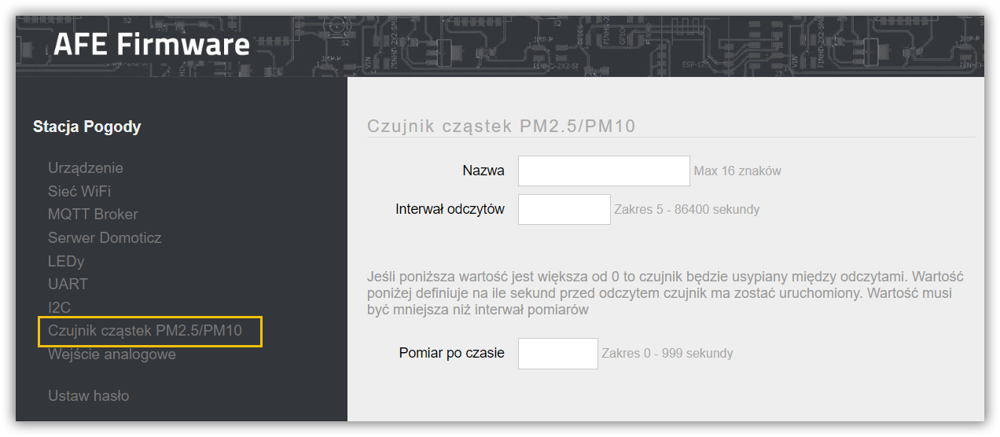
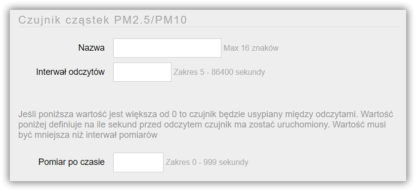
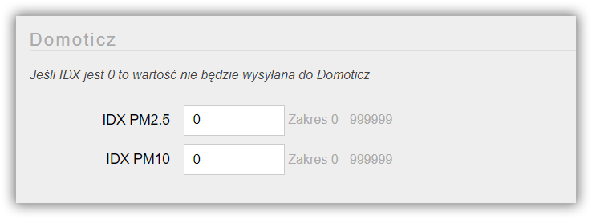

**Honeywell HPMA115S0** to czujnik cząstek PM2.5 z wyjściem UART. Czujnik zbudowany jest na bazie laseru wykorzystującym metodę rozpraszania światła do wykrywania i zliczania cząstek w zakresie stężenia 0µg/m3 do 1000µg/m3. 

##### Specyfikacja
* Czas reakcji: <6s
* Maksymalny prąd zasilania: 80mA, napięcia zasilania: 5V±0.2V
* Sygnał wyjściowy, UART
* Wyjście PM2.5 (wyjście PM10 opcjonalne wymaga dodatkowego programowania)
* Zakres temperatury roboczej od -10°C do 50°C
* [Specyfikacja HPMA115S0-XXX](Sensor%20HPMA115S0-XXX.pdf)

---

!!!! **Uwaga**: jeśli lina RX, do której podłączony jest czujnik zostanie podczas jego działania zwarta do GND, ESP8266 + AFE utraci połączenie z czujnikiem. RX jest zwierane do GND podczas: mechanicznego lub software'owego restartu urządzenia.Jeśli problem wystąpi należy odłączyć na chwilę zasilanie od urządzenia lub czujnika. Gdyby ktoś [znalazł na to rozwiązanie](https://arduino.stackexchange.com/questions/49240/honeywell-hpma115s0-sensor-not-start-again-after-stop/?target=_blank), proszę o [kontakt](/kontakt)

---

Ekran do konfiguracji czujnka Honeywell otwiera się wybierając opcję Czujnik cząstek PM2.5/PM10 w menu Panelu Konfiguracyjnego AFE Firmware.

#### Sekcja: Czujnik cząstek PM2.5/PM10

##### Nazwa
* Nazwa czujnika
* Nazwa wykorzystywana jest do odczytu wartości z czujnika za pomocą HTTP
* Maksymalna długość nazwy to do 16 znaków
* Nie należy używać znaków spacji

##### Interwał odczytów
* Częstotliwość odczytów oraz przesyłania daych do systemu automatyki
* Wartość z zakresu od 5 sekundy do 24 godzin. Wartość wprowadza się w sekundach

##### Pomiar po czasie
* Jeśli wartość jest inna niż 0, wentylator czujnika będzie wyłączany między pomiarami
* Wartość większa niż 0 ustawia na ile sekund przed odczytem włączyć wentylator

> Zalecam ustawić tę wartość na minimalnie 5 sekund, aby wentylator mógł zaciągnąć powietrze do czujnika.

#### Sekcja: Domoticz

! Sekcja konfiguracyjna widoczna jest tylko, gdy włączone jest [Domoticz API](/konfiguracja/konfiguracja-urzadzenia/konfiguracja-urzadzenia)

* Każdy pomiar odczytywany, przez czujnik może być wysyłany do Domoticz
* Wartość z zakresu 1 do 999999
* W przypadku wprowadzenia 0, wartość danego pomiaru, nie będzie wysyłana do Domoticz

#### Sekcja: Temat MQTT Czujnika HPMA115S0

Aby było możliwe przysłanie wartości do systemu automatyki z wykorzytaniem MQTT API, konieczne jest ustawienie Tematu MQTT dla czujnika

! Sekcja konfiguracyjna widoczna jest tylko, gdy włączone jest [MQTT API](/konfiguracja/konfiguracja-urzadzenia/konfiguracja-urzadzenia)

##### Temat
* Temat wiadomości w formacie MQTT
* Maksymalnie 64 znaki
* Jeśli temat nie zostanie wprowadzony, informacje z czujnika nie będa wysyłane do Brokera MQTT

> Tutaj znajdziejsz: [Najlepsze praktyki dotyczące formatów tematów MQTT](/integracja-api/mqtt/tematy-mqtt-najlepsze-praktyki)