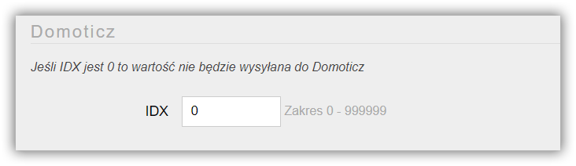

**AS3935** to czujnik wykrywający pioruny oraz potrafiący oszacować odległość od czoła burzy w promieniu do 40 km. 

##### Specyfikacja:
* Zasięg wykrywania burzy: promień do 40km
* Dokładnością do 1km
* Wbudowany algorytm odrzucający fałszywe zdarzenia
* Programowany poziom\odległość od którego mają być wysyłane alarmy
* Napięcie zasilania: 2.4 do 5.5V
* Port SPI lub I²C
* [Specyfikacja AS3935](Sensor%20AS3935.pdf)

===

