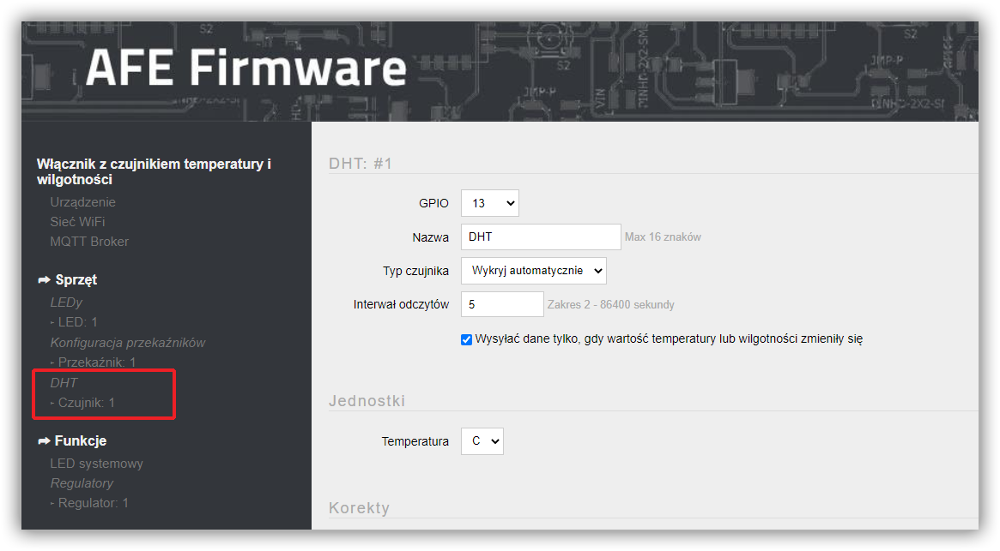
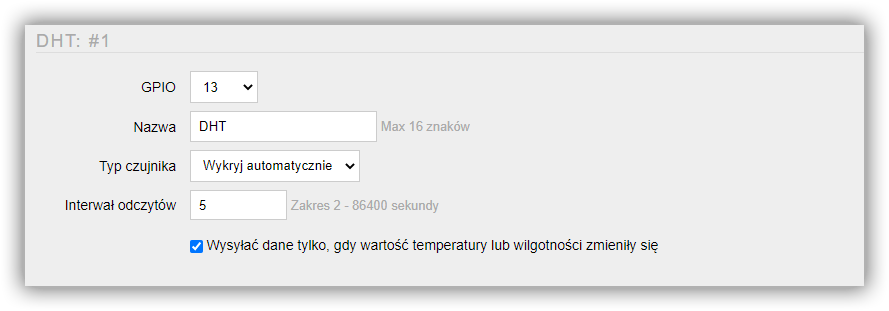
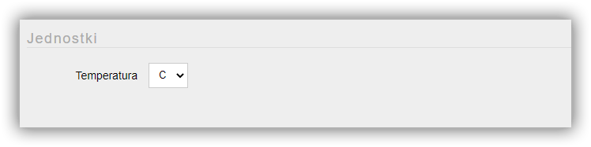
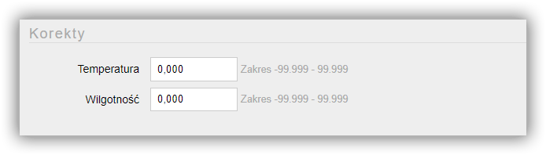
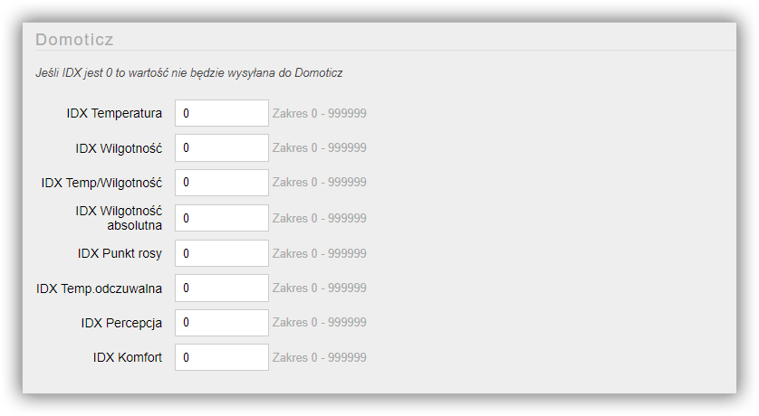
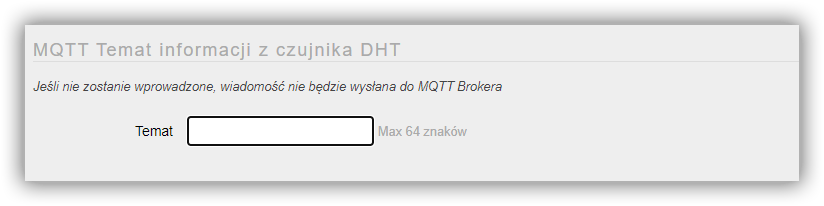

---


**Spis treści**

    
    
    {{ table_of_contents }}
    



---

#### Specyfikacje czujników

Czujniki DHT to zintegrowany czujnik temperatury oraz wilgotności. 

##### Specyfikacja DHT11

* Zakres pomiaru temperatury: -20 do 60 °C
* Dokładność pomiaru temperatury: ± 2 °C
* Zakres pomiaru wilgotności powietrza: 5 - 95 % RH
* Dokładność pomiaru wilgotności powietrza: ±4 %RH
* Pobór prądu: 0,2 mA
* Napięcie zasilania: 3,3 V do 5,5 V

! Czujnik DHT11 ma dość słabe parametry, sugeruję stosować czujniki DHT22. Ponado nie zalecam kupować czujników z nadrukiem ANSRI - są z nimi problemy

##### Specyfikacja DHT22/AM2302

* Zakres pomiaru temperatury: -40 do 80 °C
* Dokładność pomiaru temperatury: ± 0,5 °C
* Zakres pomiaru wilgotności powietrza: 0 - 100 % RH
* Dokładność pomiaru wilgotności powietrza: ±2 %RH
* Czas odpowiedzi: średnio 2 s
* Pobór prądu: 0,2 mA
* Napięcie zasilania: 3,3 V do 6 V

##### Specyfikacja RHT03

* Zakres pomiaru temperatury: -40 do 60 °C
* Dokładność pomiaru temperatury: ± 0.5 °C
* Zakres pomiaru wilgotności powietrza: 0-100% RH
* Dokładność pomiaru wilgotności powietrza: ±2 %RH
* Pobór prądu: 1-1.5mA
* Napięcie zasilania: 3,3 V do6 V

---

!! AFE Firmware wymaga, aby czujnik podłączony został do jednego z GPIO ESP

---

Ekran do konfiguracji czujnka DHT otwiera się wybierając opcję Czujnik DHT -> Czujnik w menu Panelu Konfiguracyjnego AFE Firmware.

#### Sekcja Czujnik DHT

##### GPIO
* Numer GPIO do którego podłączony jest przekaźnik
* Zakres od 0 do 16
* Wartość musi zostać wybrana

##### Nazwa
* Nazwa czujnika
* Nazwa wykorzystywana jest do odczytu wartości z czujnika za pomocą HTTP
* Maksymalna długość nazwy to do 16 znaków
* Nie należy używać znaków spacji

##### Typ czujnika
* Lista obsługiwanych czujników DHT

##### Interwał odczytów
* Częstotliwość odczytów oraz przesyłania daych do systemu automatyki
* Wartość z zakresu od 2 sekundy do 24 godzin. Wartość wprowadza się w sekundach

#### Sekcja jednostki

##### Temperatura
* Wybór jednostki, w której mają być wyświetlane wartości związane z temperaturą: np. temperatura, Punkt rosy, Head Index
* C - Celsjusz, F - Fahrenheit

#### Sekcja Korekty

W tym miejscu można dokonać kalibracji wartości czujnika dla poszczególnych pomiarów

##### Temperatura
* Wartość korekty temperatury odczytanej przez czujnik
* Wartośc minimalna to -99.999 wartośc maksymalna korekty to 99.999

##### Wilgotność
* Wartość korekty wilgotności odczytanej przez czujnik
* Wartośc minimalna to -99.999 wartośc maksymalna korekty to 99.999

#### Sekcja: Domoticz

! Sekcja konfiguracyjna widoczna jest tylko, gdy włączone jest [Domoticz API](/konfiguracja/konfiguracja-urzadzenia/konfiguracja-urzadzenia)

* Każdy pomiar odczytywany, przez czujnik może być wysyłany do Domoticz
* Wartość z zakresu 1 do 999999
* W przypadku wprowadzenia 0, wartość danego pomiaru, nie będzie wysyłana do Domoticz

#### Sekcja: Temat MQTT CzujnikaDHT

Aby było możliwe przysłanie wartości do systemu automatyki z wykorzytaniem MQTT API, konieczne jest ustawienie Tematu MQTT dla czujnika

! Sekcja konfiguracyjna widoczna jest tylko, gdy włączone jest [MQTT API](/konfiguracja/konfiguracja-urzadzenia/konfiguracja-urzadzenia)

##### Temat
* Temat wiadomości w formacie MQTT
* Maksymalnie 64 znaki
* Jeśli temat nie zostanie wprowadzony, informacje z czujnika nie będa wysyłane do Brokera MQTT

> Tutaj znajdziejsz: [Najlepsze praktyki dotyczące formatów tematów MQTT](/integracja-api/mqtt/tematy-mqtt-najlepsze-praktyki)
