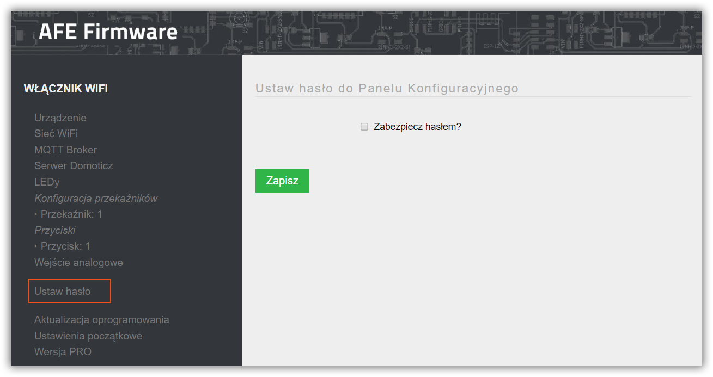
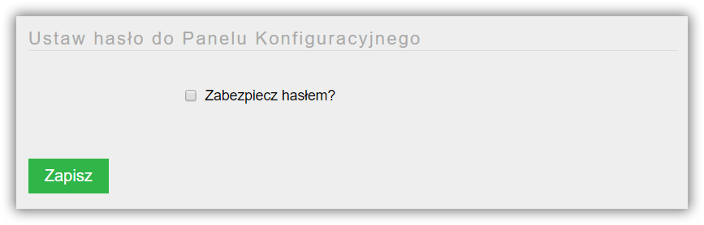
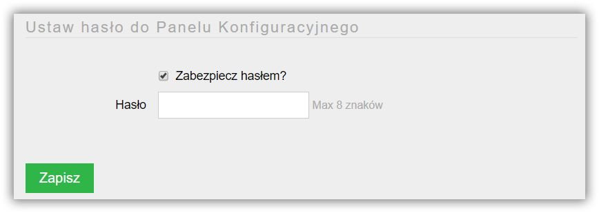
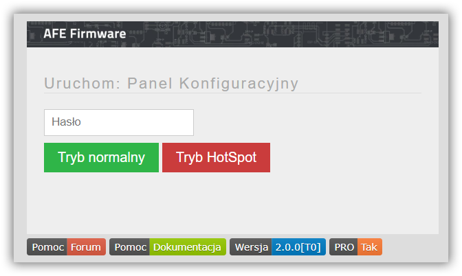

Wejście do panelu konfiguracyjnego AFE Firmware można zabezpieczyć hasłem

Po uruchomieniu panelu konfiguracyjnego należyć uruchomić ekran konfiguracji hasła, wybierąc z menu AFE Firmware opcję **Ustaw hasło**

W kolejnym kroku zaznaczamy opcję **Zabezpiecz hasłem**  oraz zapisujemy.

> Jeśli chcemy zlikwidować zabezpieczenie panelu konfiguracyjnego hasłem opcja **Zabezpiecz hasłem** nie powinna być zaznaczona.  

Po zapisaniu możemy wprowadzić hasło, które może zawierać od 1 do 8 znaków. 

Po zapisaniu hasło zostanie ustawione, a każda ponowna próba uruchomienia Panelu Konfiguracyjengo będzie wymagała wprowadzenia hasła.

!! Uwaga: AFE Firmware nie posiada opcji odzyskiwania zapomnianego hasła. Jeśli zapomnisz hasło, będzie konieczne zresetowanie urządzenia do wartości domyślnych. Jest to możliwe tylko i wyłacznie, kiedy do urządzenia podłączony jest [przycisk z funkcją: przycisku systemowego](/konfiguracja/konfiguracja-przycisku-wlacznika). Jeśli taki przycisk nie jest podłączony do ESP8266/8285 konieczne będzie wgranie ponowne firmware z wcześniejszym wyczyszczeniem pamięci Flash modułu.

