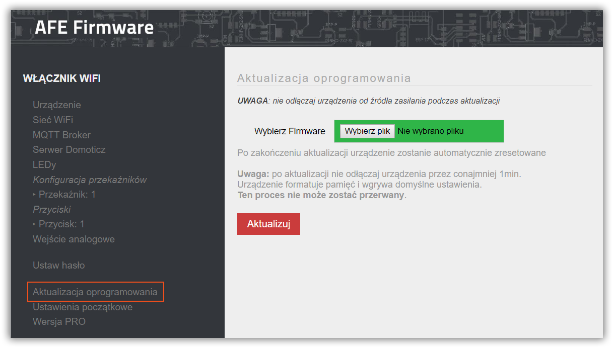

Urządzenie z AFE Firmware umożliwia aktualizację lub zmianę typu AFE Firmware na inną przez przeglądarkę.

Aby zaktualizować lub zmienić typ AFE Firmware

* [pobierz AFE Firmware](/pliki-to-pobrania/afe-firmware), które będzie wgrywane
* uruchom Panel Konfiguracyjny, a następnie wybierz opcje **Aktualizacja oprogramowania** w menu AFE Firmware

* przejdź do sekcji Aktualizacja firmware, a następnie wciśnij przycisk **Wybierz plik**
* wskaż wcześniej pobraną wersję firmware, która będzie wgrywana
* wciśnij przycisk **Aktualizuj**.
* po aktualizacji, urządzenie zostanie zresetowane z nowym firmware

!! Podczas aktualizacji firmware przez przeglądarkę nie odłączaj urządzenia od źródła zasilania

! Przy zmianie oprogramowania, część parameterów konfiguracyjnych może wymagać rekonfigurację.

! Przy zmianie oprogramowania z wersji 1.x do wersji 2.x nie jest kopiowana konfiguracja. Urządzenie należy [skonfigurować od początku w trybie HotSpot.](/instalacja/pierwsze-uruchomienie)