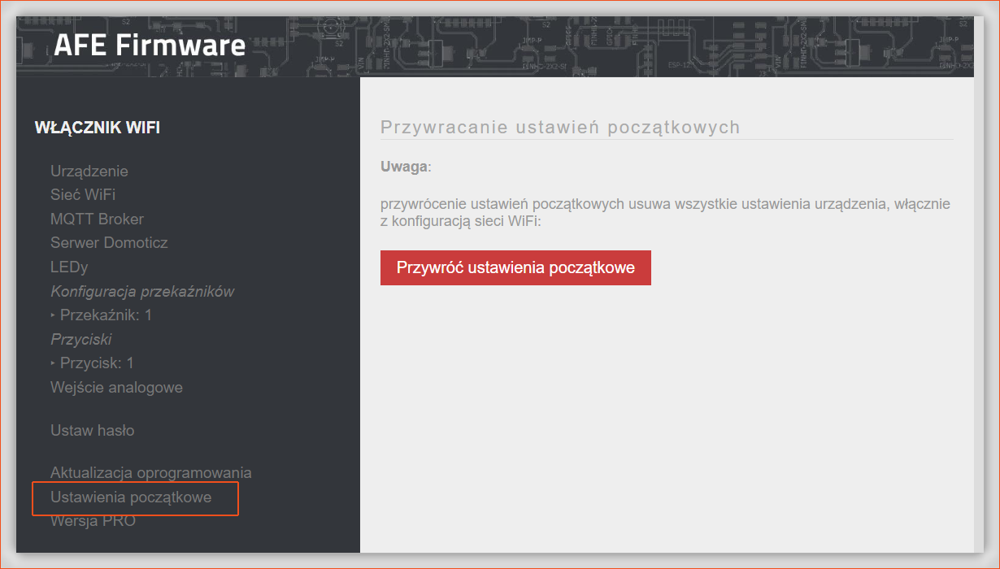

Firmware umożliwia przywrócenie urządzenia do stanu domyślnego, czyli usunięciu całej aktualnej konfiguracji oraz załadowaniu konfiguracji domyślnej AFE Firmware. 

! Przywracanie ustawień domyślnych, przywraca ustawienia domyślne AFE Firmware, a nie fabryczne urządzenia. Np. jeśli do urządzenia Itead Sonoff wgramy AFE Firmware, a następnie skorzystamy z funkcji Ustwienia domyślne to zostaną przywrócone ustawienia domyślne AFE Firmware, a nie oryginalne fabryczne oprogramowania urządzenia Itead Sonoff

##### Procedura:

* Uruchom Panel Konfiguracyjny, a następnie z menu AFE Firmware wybierz opcję **Ustawienia początkowe**

* Przejdź do sekcji: Przywracanie ustawień początkowych
* Wciśnij przycisk: **Przywróć ustawienia początkowe**
* Po około 20-30 sekundach urządzenie zostanie przywrócone do stanu początkowego
* Skonfiguruj urządzenie, jak w przypadku [pierwszego uruchomienia](/instalacja/pierwsze-uruchomienie)

Alternatynie, przywrócenie ustawień domyślnych AFE Firmware może wykonać, wciskając [przycisk z funkcją przycisku mulitifunkcyjnego](/konfiguracja/konfiguracja-przycisku-wlacznika), na 30 sek, ale nie dłużej niż 35sek.

Jeśli jest podłączona do urządzenia [sysemowa dioda LED](/konfiguracja/konfiguracja-diody-led)  to może pomóc w określeniu kiedy puścić przycisk, aby zresetować ustawienia. Więcej informacji na ten temat znajdziesz [tutaj](/konfiguracja/konfiguracja-diody-led/dioda-systemowa).
