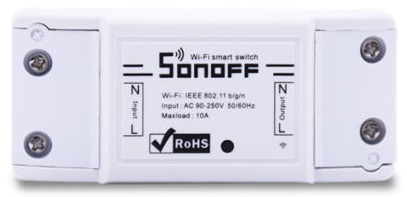

#### Sonoff Basic

| GPIO | Podłączenie |
| - | - |
| GPIO0	| Przycisk na obudowie |
| GPIO12 | Przekaźnik |
| GPIO13 | Zielony LED |
| GPIO3	| RX pin (do użycia do zewnętrznych czujników) |
| GPIO1	| TX pin (do użycia do zewnętrznych czujników) |
| GPIO14 | Opcjonalny pin na czujnik |

#### Sonoff Basic RF

| GPIO | Podłączenie |
| - | - |
| GPIO0	| Przycisk na obudowie |
| GPIO12 | Przekaźnik i czerowna dioda|
| GPIO13 | Zielony LED |
| GPIO1	| RX pin (do użycia do zewnętrznych czujników) |
| GPIO3	| TX pin (do użycia do zewnętrznych czujników) |
| GPIO4 | Opcjonalny pin na czujnik |
| GPIO14 | Opcjonalny pin na czujnik |
