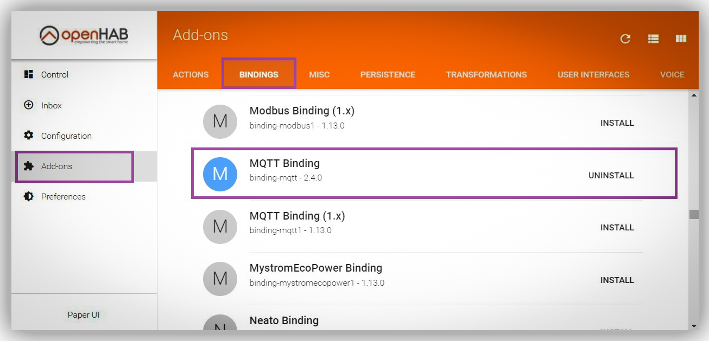

OpenHab’a (OH2) można skonfigurować na kilka różnych sposobów, aby funkcjonował z urządzeniami z AFE Firmware.

Opisuję tutaj sposób z wykorzystaniem lekkiego protokołu wymiany widomości opartego o MQTT. Wg mnie jest to jeden z najlepszych mechanizmów integracji urządzeń w ramach automatyki.

[Konfiguracja](https://www.smartnydom.pl/afe-firmware-pl/konfiguracja/openhab/) openHAB w starej wersji MQTT Binding 1.4

### openHAB z wykorzystaniem MQTT API (MQTT Binding w wersji 2.x)
#### Wymagania
* Zainstalowany dodatek OH2: MQTT binding 2.x w openHAB
* Zainstalowany MQTT Broker np. Mosquitto

! Informacja: Od wersji 2.4 dostępny jest dodatek: Embaded MQTT Broker.  Teoretycznie można go wykorzystać zamiast Mosquitto. Natomiast praktycznie są z nim problemy dlatego na dzień dzisiejszy nie będę go wykorzystywał w tej instrukcji.

* Zainstalowany dodatek OH2: JSONPath Transformation
* Urządzenie z zainstalowanym AFE Firmware

#### Kroki instalacji oraz konfiguracji
* Instalacja wymaganych dodatków w OpenHAB
* Instalacja MQTT Brokera
* Instalacja AFE Firmware
* Konfiguracja AFE Firmware
* Konfiguracja openHAB za pomocą Paper UI
	* Konfiguracja połączenia do MQTT Brokera
	* Dodawanie nowego Thing (rzecz, urządzenie)
	* Dodawanie nowych Items (elementów urządzenia)
	* Zbudowanie sitemap’y do wyświetlania elementów
* Konfiguracja openHAB bez pomocy Paper UI (zaawansowane, ale szybsze)

#### Instalacja wymaganych dodatków w OpenHAB
> Wszystkie dodatek będą instalowane za pomocą interface PaperUI dostępnego w openHAB.

Otwieramy openHAB Paper UI:

`http://IP-OPENHAB:PORT-OPENHAB/paperui/`
 
np.:

`http://192.168.2.146:8080/paperui/`

##### Instalacja MQTT Binding 2.x

##### Instalacja JSONPath Transformation

#### Instalacja MQTT Brokera

_Do napisania. Tymczasem poszukaj w internecie_

#### Instalacja AFE Firmware

Postępuj wg tej [instrukcji](l/instalacja/instalacja-zanim-zainstalujesz-firmware)

#### Konfiguracja AFE Firmware
##### Włączamy MQTT API

Uruchamiamy w urządzeniu Panel Konfiguracyjny
Włączamy MQTT API

Zapisujemy zmiany

##### Konfigurujemy połączenie do MQTT Brokera
w konfiguracji wpisujemy albo nazwę hosta bądź adres IP, na którym zainstalowany jest MQTT Broker. Najczęściej będzie to ten sam host/adres IP, na którym zainstalowany jest openHAB
Jeśli nie ma autoryzacji do MQTT Brokera – nazwę użytkownika oraz hasło zostawiamy puste.
Ważne:

W tym miejscu konfigurujemy temat wiadomości MQTT API.
Na ekranie wpisałem temat wiadomość /t0/ i taki będę używał w dalszej części tej instrukcji
Zalecam ustalić sobie jakiś spójne nazewnictwo i używać dla wszystkich urządzeń np:
/sonoff/
/salon/lampa/
/kuchnia/termometr/
Temat musi być unikalny w ramach wszystkich urządzeń, które korzystają z MQTT Brokera – czyli w ramach naszego domu może występować tylko jedno urządzenie z takim tematem MQTT
Nie można używać znaku spacji w ramach tematu MQTT

Zapisujemy zmiany

##### Ustalamy nazwę przekaźnika
Ustalamy nazwę przekaźnika, aby nim sterować za pomocą MQTT.

Dlaczego? w ramach urządzenia może być wiele przekaźników (dot. AFE Firmware wersja T3 oraz T4), aby rozróżnić, którym przekaźnikiem chcemy sterować trzeba nadać każdemu przekaźnikowi unikalną nazwę w ramach urządzenia. Nazwę przekaźnika należy nadać w każdej wersji AFE Firmware – nawet jeśli zainstalowany AFE Firmware obsługuje tylko jeden przekaźnik

Zapisujemy zmiany
Uwaga: nazwa przekaźnika nie może zawierać znaków spacji

Teraz możemy już wyjść z konfiguracji AFE Firmware wciskając link: Zakończ konfigurację

#### Konfiguracja openHAB za pomocą Paper UI
Jak napisałem we wstępie openHAB można konfigurować na wiele różnych sposobów. Poniższy sposób wykorzystuje interfejs Paper UI. Można konfigurację wykonać ręcznie w plikach konfiguracyjnych. Konfigurowanie w plikach konfiguracyjnych jest szybsze, ale trzeba już trochę poznać openHAB i wiedzieć jak diagnozować błędy, które możemy zrobić podczas ręcznej konfiguracji. Konfiguracja ręczna jest opisana w dalszej części tego tutorial’a

##### Konfiguracja połączenia do MQTT Brokera
Teraz konfigurujemy połączenie do zainstalowanego MQTT Brokera. OpenHAB będzie nasłuchiwał wiadomości przychodzące do MQTT Brokera oraz będzie do niego wysyłał wiadomości, które będą sterowały naszymi urządzeniami

Uruchamiamy ponownie openHAB PaperUI
Wchodzimy do Inbox i wciskamy (+)

##### Wybieramy MQTT Binding

Wciskamy Add Manually

 Wprowadzamy nazwę oraz ID dla naszego MQTT Brokera w ramach openHab
Name: Moj MQTT Broker
Thing ID (musi być unikalne, bez spacji): MojMQTTBroker

##### Wprowadzamy Host lub adres IP oraz Port do naszego MQTT Broker.

Wpisujemy Client IT – nie jest to konieczne, ale ułatwia później śledzenie potencjalnych problemów w log’ach naszego MQTT Brokera

##### Wprowadzamy nazwę i hasło do MQTT Brokera (jeśli używamy)

Zapisujemy wciskając tę niebieską kulkę z „ptaszkiem” u góry powyższego ekranu
Powinniśmy teraz odszukać nasz MQTT Broker na liście Things „Rzeczy” – jeśli jest OnLine – to wszystko poszło OK – jesteśmy podłączeni z openHAB do MQTT Brokera

##### Dodawanie nowego Thing (rzecz, urządzenie)
Teraz dodamy nasze urządzenie, jako Thing do do OpenHAB

Wchodzimy ponownie do Inbox i wciskamy (+)
Wybieramy MQTT Binding
Wciskamy Add Manually
Tym razem wybieramy Generic MQTT Thing

Wpisujemy nazwę naszego, ID naszego urządzenia
Name: Moje Urządzenie
Thing ID (musi być unikalne, bez spacji): MojeUrzadzenie
Wybieramy Bridge Selection: na liście powinien znajdować się nasze połączenie do MQTT Brokera o nazwie: Moj MQTT Broker

Teraz nasze urządzenie powinno pokazać się na liście urządzeń z nazwą Moje Urządzenie

Klikamy w nazwę Moje urządzenie. Wyświetli nam się to okno
Będziemy teraz dodawać elementy fizyczne w ramach urządzenia. Mogą to być przekaźniki, czujnik temperatury, wilgotności itp.. Mogą to również elementy wirtualne, jak np. wirtualny włącznik, który uruchamia panel konfiguracyjny urządzenia z AFE Firmware
Dodamy przekaźnik. Wciskamy (+) przy Channels

Wybieramy Channel Typ: On/Off switch
Wprowadzamy unikalny ID w ramach Thing (unikalne w ramach Thing, bez spacji): Przekaznik
Nadajemy label’kę: Przekaźnik

Wprowadzamy
MQTT State topic: /t0/switch/state
Jest to temat MQTT pod który AFE Firmware wysyła w jakim stanie jest przełącznik: włączony / wyłączony
/t0/ – zdefiniowaliśmy w AFE Firmware w konfiguracji MQTT Brokera
/switch/ – zdefiniowaliśmy w AFE Firmware w konfiguracji przekaźnika. Nazwa przekaźnika
/state – trzeba wpisać, wymagane przez AFE Firmware
MQTT Command topic: /t0/switch/cmd
Jest to komenda wysyłana przez openHAB do AFE Firmware, która steruje przekaźnikiem
/t0/ – zdefiniowaliśmy w AFE Firmware w konfiguracji MQTT Brokera
/switch/ – zdefiniowaliśmy w AFE Firmware w konfiguracji przekaźnika. Nazwa przekaźnika
/cmd – trzeba wpisać, wymagane przez AFE Firmware

wprowadzamy wartości
On/Open: on
Off/Closed: off

Wciskamy Save
Takie coś powinno nam się ukazać po zapisaniu.
W żółtej ramce jest zaznaczony tekst, który wykorzystam podczas dodawania Items

Możemy sprawdzić, czy da się sterować urządzeniem
Wchodzimy w Control, Others i wyszukujemy box’ik z nazwą Moje Urządzenie
Przełącznikiem powinniśmy móc sterować przekaźnikiem

Aby dodać inne elementy urządzenia (w zależności od funkcjonalności AFE Firmware) postępuj analogicznie powtarzając ten punkt instrukcji.
Tutaj są wszystkie komendy MQTT do wykorzystania w dodatkowych Channels lub skorzystaj z gotowej tej listy parameterów dla Channels 
Dodawanie nowych Items (elementów urządzenia)
Aby móc sterować urządzeniem z aplikacji mobilnej openHAB lub innej lub za pomocą interfejsu ClassicUI, BasicUI, HabPanel itp. konieczene jest dodanie elementów (items)
W PaperUI nie można dodawać items. Robi się to ręcznie w plikach konfiguracyjnych lub można skorzystać z HomeBuilder w ramach openHAB, który wspomaga robienie Items oraz Sitemap’ę
Ja pokażę jak to robić ręcznie bez wykorzystania HomeBuilder’a
Items dodajemy w plikach, które znajdują się w katalogu konfiguracyjnym

/etc/openhab2/items/

1
2
3
 
/etc/openhab2/items/
 
Sugestia: sugeruje różnego typu elementy (items) tworzyć w osobnych plikach. Z czasem nasz system do automatyki rozbuduje się i trzymanie wszystkiego w jednym pliku będzie uciążliwe do zarządzania.

Przykładowa struktura moich plików z items

Na potrzeby tego tutorial tworze nowy plik w tym katalogu o nazwie: przelaczniki.items
Uwaga: po utworzeniu nowego pliku sprawdź, czy właścicielem pliku jest użytkownik: openhab oraz grupa: openhab

Do pliku dodajemy nasz Item

Switch moj_pierwszy_switch "Przełącznik" {channel="mqtt:topic:MojeUrzadzenie:Przekaznik"}

1
2
3
 
Switch moj_pierwszy_switch "Przełącznik" {channel="mqtt:topic:MojeUrzadzenie:Przekaznik"}
 
Legenda:

Switch – typ Item
moj_pierwszy_switch – unikalna nazwa item
„Przełącznik” – labelka wyświetlania
{channel=”mqtt:topic:MojeUrzadzenie:Przekaznik”} – połączenie Item z Thing
Skąd wziąłem: mqtt:topic:MojeUrzadzenie:Przekaznik – żółta ramka, o której wspomniałem wcześniej

Zapisujemy zamiany w pliku
Zbudowanie sitemap’y do wyświetlania elementów
Sitemap’ę można zbudować za pomoca HomeBuilde’ra lub oczywiście ręcznie 🙂 w plikach konfiguracyjnych
Sitemap’y znajdują się w katalogu konfiguracyjnym:

/etc/openhab2/sitemaps

1
2
3
 
/etc/openhab2/sitemaps
 
To co musimy zrobić to umieścić w naszej sitemap’ie zdefiniowany w poprzednim punkcie Item
Do SiteMapy trzeba wprowadzić następujący element

Switch item=moj_pierwszy_switch

1
2
3
 
Switch item=moj_pierwszy_switch
 
Switch – typ elementu, który mam nam się wyświetlić
item=moj_pierwszy_switch – wiąże typ elementu Switch z naszym Item. Jak widać po znaku = wpisuje nazwę Item, który zdefioniowałem w poprzednim kroku
Uwaga: jeśli w katalogu konfiguracyjnym nie mamy, żadnej sitemap’y trzeba utworzyć nową sitemap’ę np. MojDom.sitemap

sitemap MojDom label="Mój Dom" {

    /* Tutaj są elementy naszej sitemapy */
    Switch item=moj_pierwszy_switch
}

1
2
3
4
5
6
7
 
sitemap MojDom label="Mój Dom" {
 
    /* Tutaj są elementy naszej sitemapy */
    Switch item=moj_pierwszy_switch
}
 
Zapisujemy zmiany
Od teraz powinniśmy móc sterować naszym przełącznikiem za pomocą aplikacji mobilnej openHAB lub innych interfejsów, jak ClassicUI, BasicUI, HABPanel itp
Jeśli mamy zainstalowany w openHAB BasicUI to otwarcie poniższego URL powinno uruchomić utworzoną w poprzednim kroku SiteMap’ę MojDom.sitemap

http://IP-OPEN-HAB:8080/basicui/app?sitemap=MojDom

1
2
3
 
http://IP-OPEN-HAB:8080/basicui/app?sitemap=MojDom
 
